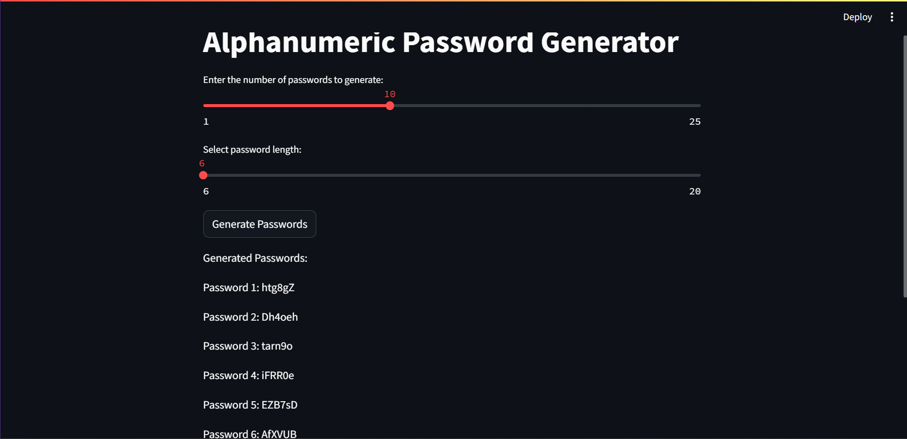

# Example of how to use Gradio and Streamlit

## How to use

1. It is suggested to use a venv to install the dependencies.

2. Install [Gradio](https://www.gradio.app/guides/quickstart) and [Streamlit](https://docs.streamlit.io/get-started/installation) or use the requirements.txt file.

```bash
pip install -r requirements.txt
```

3. Run the app using Gradio or Streamlit.

for Gradio:

```bash
python grad1.py
```

for Streamlit:

```bash
streamlit run stm1.py
```

## Password Generator using Gradio

<!-- attach image -->


## Password Generator using Streamlit


